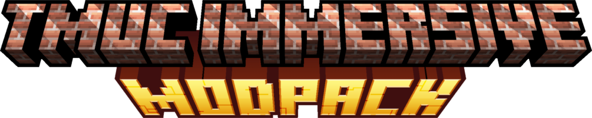
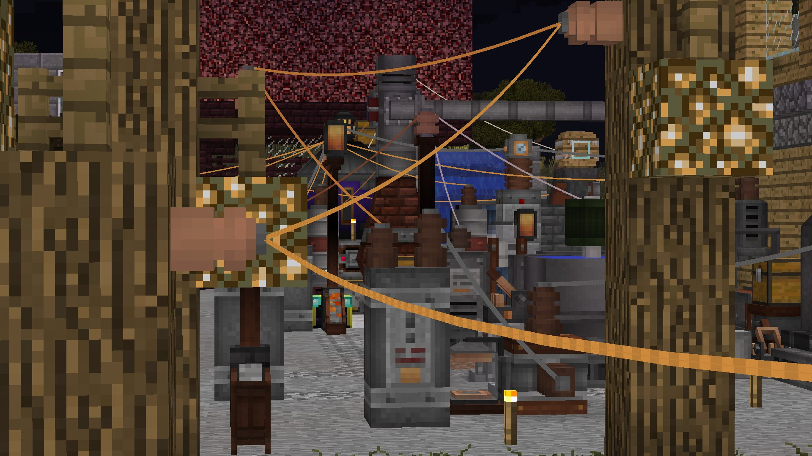

# TMUC-Immersive

### Tech Modpack Ultimate Collection

Приготовьте побольше места, ибо одноблочным механизмам тут не место!

[Здесь](https://docs.google.com/spreadsheets/d/1bv3wSOOAYknZF-W-Vb7Z4XiVB1TjS_w6DbVVe4Pj3Tc/edit?usp=sharing) можно найти список модов и другую полезную информацию.

Такс, я подчистил репо, пока оно чисто информационное, скачать архивчики можно [здесь](https://disk.yandex.ru/d/gtrn9ptmUbXaWw) и [здесь](https://drive.google.com/drive/folders/1FMeq2MnRWCnloDQC6zSTRFKN0Dgb8YcW?usp=sharing)

# Installation
- Установите Minecraft 1.12.2. Выберите одну из папок (пустых) и запомните её.
- Установите Forge 14.23.5.2860, выбрав ту же папку.
- Переместите файлы из архива в папку игры
- Некоторые моды я не могу разместить здесь, поэтому их придётся дозагрузить самостоятельно
  - К ним относится оптифайн, по [этой](https://optifine.net/copyright) причине, скачать можно [здесь](https://optifine.net/adloadx?f=OptiFine_1.12.2_HD_U_G5.jar)
  - Immersive Railroading, файл мода слишком большой для гитхаба, [ссылка](https://www.curseforge.com/minecraft/mc-mods/immersive-railroading/files/4970105) для скачивания.
  - Ресурспак к MAtmos, [ссылка](https://www.curseforge.com/minecraft/texture-packs/matmos-2020-zen/files/3407318)
- Готово. Используемые мной настройки игры и модов также включены.

## Other Modpacks
Вы можете найти эту и другие мои сборки [здесь](https://monsieurfeb.github.io/modpacks.html)

А в этой [таблице](https://docs.google.com/spreadsheets/d/1u5vIX8oGjELeDfsSiaR8NvIATlkEW-N-MmX3r2Xlx8Q/edit?usp=sharing) статус разработки модпаков коллекции.

## Contact me
Просьба писать на почту MonsieurFeb@yandex.ru или [Telegram](https://t.me/thirdBTP/824)

(Или на других платформах, но быть везде - невозможно!)

